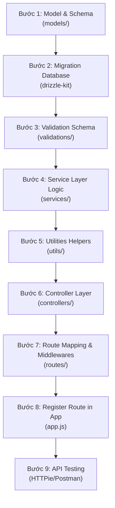

# 🚀 Hướng Dẫn Học Tập Lập Trình Web Backend
*Tài liệu hướng dẫn dựa trên quy trình thiết lập trong [demo_raw_quickstart.md](file:///E:/08_Project/Devops_Course/acquisitions/demo_raw_quickstart.md)*

Tài liệu này sẽ giải thích chi tiết các bước, trả lời toàn bộ câu hỏi và giới thiệu các thư viện để giúp bạn nhanh chóng làm chủ lập trình Web Backend sử dụng hệ sinh thái Modern Node.js (ES Modules), Express, ORM Drizzle và Postgres.

---

## 📂 1. Cấu Trúc Thư Mục Dự Án & Ý Nghĩa (Project Architecture)

Khi xây dựng một ứng dụng Web Backend chuyên nghiệp, việc tổ chức thư mục theo kiến trúc phân lớp (Layered Architecture) giúp mã nguồn dễ bảo trì, mở rộng và kiểm thử.

### Sơ đồ cấu trúc thư mục hiện tại của dự án

Dưới đây là sơ đồ chi tiết toàn bộ thư mục và file hiện tại trong dự án của bạn cùng công dụng cụ thể của từng thành phần:

```text
acquisitions/ (Thư mục gốc của dự án)
├── .dockerignore           # Chỉ định các file/thư mục Docker cần bỏ qua khi build image
├── .env                    # Lưu trữ các biến môi trường nhạy cảm (DB URL, JWT Secret, port, v.v.)
├── .gitignore              # Chỉ định các file/thư mục Git cần bỏ qua (như node_modules, .env)
├── .prettierignore         # Chỉ định các file/thư mục Prettier không cần định dạng lại
├── .prettierrc             # File cấu hình quy tắc định dạng code của Prettier
├── drizzle.config.js       # File cấu hình Drizzle Kit (nơi chỉ định schema path, output migration, DB credentials)
├── eslint.config.js        # File cấu hình quy tắc kiểm tra code của ESLint (ESLint v9+)
├── package.json            # Quản lý các dependencies, scripts chạy lệnh (dev, build, lint, db:migrate...)
├── Dockerfile              # File cấu hình để đóng gói ứng dụng thành Docker Container
├── docker-compose.dev.yml  # File Docker Compose để chạy môi trường phát triển (Development)
├── docker-compose.prod.yml # File Docker Compose để chạy môi trường vận hành (Production)
├── DOCKER_SETUP.md         # Hướng dẫn thiết lập môi trường Docker
├── README.md               # Tài liệu tổng quan giới thiệu dự án
├── WARP.md                 # Tài liệu hướng dẫn sử dụng/thiết lập Warp
├── YAML.md                 # Tài liệu hướng dẫn cú pháp YAML
├── demo_raw_quickstart.md  # Hướng dẫn cài đặt nhanh ban đầu (được giữ nguyên)
├── Learning_Demo.md        # Tài liệu hướng dẫn học tập (file này)
├── drizzle/                # Thư mục lưu trữ các file SQL Migration do Drizzle Kit sinh ra khi đồng bộ DB
├── public/                 # Thư mục chứa các tài nguyên tĩnh công khai (hình ảnh, tài liệu...)
│   └── readme/             # Chứa hình ảnh hiển thị trong các file hướng dẫn Markdown
│       ├── hero.webp
│       ├── jsmpro.webp
│       ├── thumbnail.webp
│       └── thumbnail2.webp
├── scripts/                # Thư mục chứa các shell script để khởi chạy nhanh trên Linux/macOS (dev.sh, prod.sh...)
├── tests/                  # Thư mục chứa các file kiểm thử tự động (Unit & Integration Tests)
│   └── app.test.js         # File kiểm thử tích hợp cho ứng dụng Express chính
└── src/                    # Thư mục chứa mã nguồn chính của Backend
    ├── app.js              # Khởi tạo Express app, cấu hình middleware toàn cục và kết nối routes
    ├── index.js            # Điểm bắt đầu (Entrypoint) nạp biến môi trường và chạy server
    ├── server.js           # Khởi chạy HTTP Server lắng nghe trên cổng mạng và xử lý tắt an toàn (graceful shutdown)
    ├── config/             # Thư mục chứa cấu hình kết nối các dịch vụ bên thứ ba
    │   ├── database.js     # Cấu hình kết nối cơ sở dữ liệu Postgres bằng Drizzle Client
    │   ├── logger.js       # Cấu hình logger Winston chuyên nghiệp ghi log ra console và file
    │   └── arcjet.js       # Cấu hình tích hợp công cụ bảo mật Arcjet (Rate Limit, Bot detection, Shield)
    ├── controllers/        # Thư mục chứa logic điều phối HTTP request/response
    │   ├── auth.controller.js  # Điều phối các yêu cầu Auth (Đăng ký, Đăng nhập, Đăng xuất)
    │   └── users.controller.js # Điều phối các thao tác đối với dữ liệu User
    ├── middleware/         # Thư mục chứa bộ lọc trung gian chặn trước khi vào Controller
    │   ├── auth.middleware.js # Xác thực token JWT để bảo vệ các route cần đăng nhập
    │   └── security.middleware.js # Các cấu hình bảo mật (Helmet, Rate Limiter)
    ├── models/             # Thư mục định nghĩa DB Schema
    │   └── user.model.js   # Định nghĩa cấu trúc bảng users (id, name, email, password...) bằng Drizzle ORM
    ├── routes/             # Thư mục khai báo các endpoint URL (API Routing)
    │   ├── auth.routes.js  # Định nghĩa các route `/api/auth/register`, `/api/auth/login`, v.v.
    │   └── users.routes.js # Định nghĩa các route `/api/users/profile`, `/api/users/update`, v.v.
    ├── services/           # Thư mục chứa logic nghiệp vụ chính (Business Logic)
    │   ├── auth.service.js # Xử lý đăng ký, đăng nhập, đối chiếu mật khẩu, mã hóa mật khẩu
    │   └── users.service.js # Xử lý các thao tác CRUD người dùng trực tiếp trên cơ sở dữ liệu
    ├── utils/              # Thư mục chứa các hàm tiện ích dùng chung
    │   ├── cookies.js      # Tiện ích ghi/xóa HttpOnly Cookie trên trình duyệt
    │   ├── format.js       # Tiện ích chuẩn hóa định dạng JSON response trả về cho client
    │   └── jwt.js          # Tiện ích ký (sign) và xác thực (verify) JSON Web Token
    └── validations/        # Thư mục chứa schema kiểm tra dữ liệu đầu vào bằng Zod
        ├── auth.validation.js # Xác thực cấu trúc dữ liệu gửi lên khi đăng ký/đăng nhập
        └── users.validation.js # Xác thực cấu trúc dữ liệu gửi lên khi cập nhật thông tin user
```

---

### Sự khác biệt giữa `app.js`, `server.js` và `index.js` trong thư mục `src/`
Trong các dự án lớn, thay vì viết toàn bộ mã khởi chạy server vào một file duy nhất, ta chia làm 3 file riêng biệt để dễ bảo trì và viết kiểm thử:

1. **`app.js` (Tạo và Cấu hình Ứng dụng)**:
   * **Nhiệm vụ**: Khởi tạo thực thể `express()`, tích hợp các middleware toàn cục (CORS, Helmet, Logger, Body Parser), cấu hình định tuyến (routes) và xử lý lỗi (error handling).
   * *Lý do tách biệt*: Giúp dễ dàng import file `app` này vào các bài test (Integration Tests) mà không cần phải thực sự chạy một server nghe trên cổng mạng.
2. **`server.js` (Giám sát và Khởi chạy Server)**:
   * **Nhiệm vụ**: Đảm nhận việc lắng nghe cổng mạng (ví dụ: `app.listen(PORT)`), quản lý vòng đời của server, cấu hình các giao thức bảo mật nâng cao hoặc tích hợp WebSockets.
3. **`index.js` (Điểm bắt đầu - Entry Point)**:
   * **Nhiệm vụ**: Điểm bắt đầu của ứng dụng (bootstrap). File này sẽ nạp các cấu hình hệ thống (như biến môi trường `.env`), kết nối Database, sau đó import `server.js` hoặc `app.js` để khởi chạy ứng dụng.

---

## 🛠️ 2. Giải Đáp Các Câu Hỏi Kỹ Thuật Trong Quickstart

### ❓ Câu hỏi 1: Lệnh `--watch` là gì và có tác dụng gì?
```json
"scripts": {
  "dev": "node --watch index.js"
}
```
* **Bản chất**: Trước phiên bản Node.js 18/20, các lập trình viên thường phải cài thêm thư viện bên ngoài như `nodemon` để tự động khởi động lại server mỗi khi có thay đổi trong file code.
* **Tác dụng**: Cờ `--watch` là tính năng **nội sinh (built-in)** của Node.js. Khi bạn chạy `node --watch index.js`, Node.js sẽ giám sát toàn bộ các file được import vào dự án. Mỗi khi bạn nhấn `Ctrl + S` để lưu code, Node.js sẽ tự động restart tiến trình giúp bạn kiểm tra kết quả ngay lập tức mà không cần cài thêm `nodemon`.

---

### ❓ Câu hỏi 2: `-D` nghĩa là gì trong lệnh cài đặt `npm install`?
```bash
npm install eslint @eslint/js prettier eslint-config-prettier eslint-plugin-prettier -D
```
* **Trả lời**: `-D` là viết tắt của `--save-dev`.
* **Ý nghĩa**: Lệnh này phân loại các thư viện được cài đặt vào nhóm `devDependencies` trong file `package.json`. 
  * **Dependencies (`npm install <package>`)**: Các thư viện bắt buộc phải có để ứng dụng chạy được ở môi trường production (ví dụ: `express`, `dotenv`, `drizzle-orm`).
  * **DevDependencies (`npm install <package> -D`)**: Các công cụ chỉ phục vụ quá trình phát triển, kiểm thử, hoặc format code ở local (ví dụ: `eslint`, `prettier`, `drizzle-kit`). Khi triển khai lên server production, các gói này sẽ được bỏ qua để tối ưu dung lượng và tốc độ của ứng dụng.

---

### ❓ Câu hỏi 3: Thông tin "vulnerabilities" khi cài npm là gì? Có quan trọng không?
*Ví dụ thông báo: `29 vulnerabilities (1 low, 17 moderate, 11 high)`*
* **Bản chất**: npm tự động chạy một công cụ quét bảo mật gọi là `npm audit` dựa trên cơ sở dữ liệu lỗi bảo mật đã biết (CVE) của các thư viện mã nguồn mở.
* **Tầm quan trọng**: **CỰC KỲ QUAN TRỌNG**. 
  * Các lỗ hổng bảo mật cấp độ `High` hoặc `Critical` có thể cho phép kẻ tấn công thực thi mã độc từ xa (RCE), tấn công từ chối dịch vụ (DoS) hoặc rò rỉ dữ liệu người dùng.
* **Cách xử lý**:
  1. Chạy lệnh `npm audit` để xem chi tiết lỗ hổng đến từ thư viện nào.
  2. Chạy `npm audit fix` để npm tự động nâng cấp các package bị lỗi lên phiên bản an toàn hơn (không gây lỗi code).
  3. Với các lỗi nghiêm trọng không tự sửa được, bạn có thể chạy `npm audit fix --force` (cần cẩn thận vì có thể gây xung đột phiên bản) hoặc nâng cấp thủ công package đó.

---

### ❓ Câu hỏi 4: Các lệnh thao tác với Database bằng Drizzle hoạt động như thế nào?
Drizzle ORM hoạt động theo cơ chế **Code-First** (Định nghĩa DB Schema trong code trước, sau đó đồng bộ hóa lên cơ sở dữ liệu thật).

1. `npm run db:generate` (Tạo file Migration):
   * **Hoạt động**: Drizzle Kit sẽ đọc các file định nghĩa bảng trong thư mục `src/models/`, so sánh với lịch sử migration cũ. Sau đó, nó tạo ra một file SQL (hoặc JSON) mô tả các câu lệnh cần chạy (ví dụ: `CREATE TABLE users...`) nằm trong thư mục migrations (thường là `drizzle/`). **Lệnh này chưa tác động gì đến Database thật.**
2. `npm run db:migrate` (Áp dụng Migration vào DB):
   * **Hoạt động**: Drizzle sẽ đọc các file migration vừa được tạo ra ở bước trước và thực thi các câu lệnh SQL đó trực tiếp lên database Neon Cloud. Lúc này, các bảng và cột mới thực sự được tạo ra trên Database thật.
3. `npm run db:studio` (Trình quản trị trực quan):
   * **Hoạt động**: Khởi chạy một ứng dụng web cục bộ (mặc định tại `localhost:4983`). Drizzle Studio cung cấp giao diện trực quan (GUI) tương tự như phpMyAdmin hay DBeaver, giúp bạn xem, thêm, sửa, xóa dữ liệu trong DB cực kỳ tiện lợi mà không cần cài app quản lý DB bên ngoài.

---

### ❓ Câu hỏi 5: Tại sao phải có `created_at` và `updated_at`? Schema Backend có thể khác DB không?
```javascript
import { timestamp } from 'drizzle-orm/pg-core';
// Ví dụ định nghĩa trường
createdAt: timestamp('created_at').defaultNow().notNull(),
updatedAt: timestamp('updated_at').defaultNow().$onUpdate(() => new Date())
```
* **Tại sao cần `created_at` & `updated_at`?**
  * Giúp theo dõi lịch sử dữ liệu (Audit log): biết bản ghi được tạo khi nào và sửa đổi lần cuối lúc nào.
  * Hỗ trợ sắp xếp dữ liệu (ví dụ: hiện các bài viết mới nhất lên trước).
  * Đồng bộ hóa dữ liệu (Sync/Caching): Giúp client hoặc hệ thống cache biết dữ liệu đã thay đổi hay chưa để cập nhật.
* **Bản chất Schema và Database có thể khác nhau không?**
  * **Có thể khác nhau**. Schema ở Backend là cách mã nguồn ứng dụng định nghĩa và tương tác với dữ liệu. Database thật là nơi lưu trữ vật lý.
  * Tuy nhiên, nếu Schema khác Database (ví dụ: Schema định nghĩa cột `age` kiểu `integer` nhưng trong DB cột đó tên là `user_age` hoặc kiểu `text`), ứng dụng sẽ bị **lỗi Runtime** ngay lập tức khi truy vấn. Do đó, ta cần sử dụng các công cụ Migration (như Drizzle Kit) để đảm bảo Schema ở Backend và Database luôn đồng bộ 100%.

---

### ❓ Câu hỏi 6: Sử dụng Absolute Import (`@/test` hoặc `#config/*`) như thế nào và tại sao?
Khi dự án lớn lên, việc import file bằng đường dẫn tương đối (relative import) sẽ trở thành "cơn ác mộng":
```javascript
import { db } from '../../../../config/database.js'; // Rất dễ viết sai, khó di chuyển file
```

Để giải quyết, chúng ta sử dụng **Absolute Import** (Đường dẫn tuyệt đối từ gốc dự án):
```javascript
import { db } from '#config/database.js'; // Rõ ràng, dễ đọc, không sợ di chuyển file
```

#### Node.js Subpath Imports (`#config/*` trong `package.json`):
Node.js hiện tại đã hỗ trợ tính năng này nguyên bản (native) mà không cần cài thêm cấu hình phức tạp. Trong file `package.json`, bạn thêm trường `imports`:
```json
{
  "imports": {
    "#config/*": "./src/config/*",
    "#controllers/*": "./src/controllers/*",
    "#models/*": "./src/models/*",
    "#utils/*": "./src/utils/*"
  }
}
```
> [!NOTE]
> Bắt buộc phải sử dụng ký tự `#` ở đầu theo tiêu chuẩn của Node.js để phân biệt với các thư viện trong `node_modules`.

---

### ❓ Câu hỏi 7: Extension nào hỗ trợ gợi ý thư viện và hàm tốt nhất?
Để nâng cao hiệu suất lập trình Web với Node.js/JavaScript, bạn nên cài các extension sau trên VS Code:
1. **GitHub Copilot** hoặc **Tabnine**: Gợi ý code thông minh bằng AI.
2. **ESLint** & **Prettier - Code formatter**: Tự động phát hiện lỗi cú pháp và tự động format code chuẩn chỉnh khi lưu file.
3. **Auto Import**: Tự động tìm và import thư viện/hàm khi bạn gõ tên hàm đó.
4. **Path Intellisense**: Tự động gợi ý đường dẫn file khi bạn gõ `./` hoặc `../`.
5. **REST Client** hoặc **Thunder Client**: Giúp gửi HTTP Request (Test API) trực tiếp bên trong VS Code mà không cần mở Postman.

---

## 📚 3. Tổng Quan Về Các Thư Viện Được Đề Cập

Dưới đây là bảng tổng hợp các thư viện được sử dụng trong dự án, giúp bạn nắm rõ lý do tại sao chúng lại xuất hiện:

| Tên thư viện | Phân loại | Mô tả chi tiết vai trò |
| :--- | :--- | :--- |
| **`express`** | Core Web Framework | Thư viện tạo Web Server phổ biến nhất của Node.js. Giúp định nghĩa Router, xử lý Request/Response và quản lý các Middleware dễ dàng. |
| **`dotenv`** | Cấu hình | Đọc các biến môi trường từ file `.env` và nạp vào đối tượng `process.env`. Giúp bảo mật các thông tin nhạy cảm (như DB URL, JWT Secret Key) không bị lộ lên GitHub. |
| **`eslint`** | Công cụ chất lượng | Trình phân tích mã nguồn (Linter). Phát hiện các lỗi cú pháp, biến chưa sử dụng, hoặc các đoạn code viết sai tiêu chuẩn. |
| **`prettier`** | Công cụ định dạng | Trình định dạng mã nguồn (Formatter). Tự động căn lề, dấu chấm phẩy, khoảng trắng để toàn bộ dự án có chung một phong cách viết code. |
| **`@neondatabase/serverless`** | Kết nối Database | Driver tối ưu hóa để kết nối với cơ sở dữ liệu PostgreSQL của Neon trong môi trường Serverless/Cloud, giúp kết nối nhanh và hạn chế nghẽn kết nối. |
| **`drizzle-orm`** | ORM (Object-Relational Mapping) | Một ORM thế hệ mới cực kỳ nhẹ và nhanh. Giúp bạn viết truy vấn Database bằng cú pháp JavaScript/TypeScript thay vì viết các câu lệnh SQL thuần túy, hỗ trợ kiểm tra kiểu dữ liệu rất tốt. |
| **`drizzle-kit`** | Công cụ Migration | Bộ công cụ đi kèm với Drizzle để sinh file SQL Migration (`db:generate`) và quản lý Database giao diện web (`db:studio`). |
| **`winston`** | Ghi nhật ký (Logger) | Thư viện ghi log chuyên nghiệp. Thay vì dùng `console.log` (sẽ bị mất đi hoặc khó quản lý), Winston giúp ghi log ra file, định dạng log đẹp mắt và phân chia cấp độ log (`info`, `warn`, `error`). |
| **`helmet`** | Bảo mật | Middleware tự động thiết lập các tiêu đề HTTP bảo mật (HTTP Security Headers). Giúp bảo vệ ứng dụng khỏi các cuộc tấn công phổ biến như XSS (Cross-Site Scripting), Clickjacking. |
| **`morgan`** | Giám sát HTTP | Middleware tự động ghi log mọi request gửi tới server (ví dụ: `GET /api/users 200 - 12.3ms`). Rất hữu ích khi cần debug traffic. |
| **`cors`** | Chia sẻ tài nguyên | Cấu hình cơ chế CORS (Cross-Origin Resource Sharing). Cho phép frontend (chạy ở domain khác, ví dụ: `http://localhost:5173`) có thể gọi API tới backend (`http://localhost:3000`). |
| **`cookie-parser`** | Phân tích Cookie | Phân tích chuỗi header `Cookie` của HTTP request và chuyển thành đối tượng `req.cookies` để dễ dàng đọc dữ liệu từ Client gửi lên. |
| **`jsonwebtoken`** | Xác thực | Tạo và xác thực **JWT (JSON Web Token)**. Dùng để duy trì trạng thái đăng nhập của người dùng một cách bảo mật và không cần lưu session trên server (Stateless). |
| **`zod`** | Xác thực dữ liệu | Thư viện định nghĩa và kiểm tra tính hợp lệ của dữ liệu (Schema Validation). Kiểm tra dữ liệu đầu vào từ client gửi lên có đủ trường, đúng định dạng email, độ dài mật khẩu hay không. |
| **`bcrypt`** | Mã hóa mật khẩu | Mã hóa mật khẩu một chiều bằng thuật toán băm (hashing) an toàn kèm muối (salt). Giúp đảm bảo nếu database bị hack, kẻ tấn công cũng không thể biết mật khẩu gốc của người dùng. |

---

## 🔑 4. Bí Quyết Để Nhanh Chóng Làm Chủ Lập Trình Web Backend

Nếu bạn mới bắt đầu học lập trình Web, hãy tập trung vào lộ trình tư duy này thay vì chỉ học vẹt các thư viện:

1. **Hiểu rõ vòng đời của một HTTP Request (Request-Response Lifecycle)**:
   * Client (Trình duyệt/Postman) gửi Request -> Đi qua các Middleware (Helmet, CORS, Cookie-parser) -> Đi qua Middleware xác thực (nếu cần) -> Tới Route -> Vào Controller -> Gọi Service xử lý logic -> Tương tác với Database qua ORM -> Trả về Response cho Client.
2. **Luôn kiểm tra dữ liệu đầu vào (Never Trust User Input)**:
   * Luôn dùng **Zod** để lọc và chặn dữ liệu sai cấu trúc ngay tại cửa ngõ Controller. Không bao giờ trực tiếp đưa dữ liệu thô từ client vào Database để tránh SQL Injection và lỗi ứng dụng.
3. **Thành thạo công cụ Test API (HTTP Client)**:
   * Hãy làm quen với **HTTPie** hoặc **Postman**. Đừng dùng trình duyệt để test API vì trình duyệt mặc định chỉ gửi được request `GET` và rất khó cấu hình Header hay gửi dữ liệu Body.
4. **Viết code sạch và nhất quán**:
   * Luôn bật **ESLint** và **Prettier**. Code gọn gàng sẽ giúp bạn tránh được 80% các lỗi ngớ ngẩn (như thiếu dấu ngoặc, gõ sai tên biến).
5. **Nắm vững nguyên lý Stateless của API**:
   * Backend API nên được thiết kế độc lập. Thông tin đăng nhập nên được truyền qua **JWT** đặt trong Cookie bảo mật (`httpOnly: true`) hoặc Header `Authorization: Bearer <Token>` thay vì lưu Session trên RAM của Server. Điều này giúp hệ thống dễ dàng mở rộng (Scale) sau này.

---

## 🔄 5. Quy Trình Phát Triển Một Tính Năng Mới (Standard Development Workflow)

Khi phát triển bất kỳ tính năng nào (ví dụ: Quản lý Auth, CRUD sản phẩm, Acquisitions...), bạn nên tuân theo một quy trình phát triển từ dưới lên (Bottom-Up Workflow) để đảm bảo tính chặt chẽ, tránh lỗi kiểu dữ liệu và dễ kiểm thử.

### Quy Trình Tổng Quát (9 Bước chuẩn)



1. **Bước 1: Model & Schema (Database Layer)**: Định nghĩa cấu trúc bảng dữ liệu trong thư mục `src/models/`.
2. **Bước 2: Migration**: Chạy lệnh `npm run db:generate` để tạo file SQL migration, sau đó chạy `npm run db:migrate` để đồng bộ cấu trúc lên database thật (Postgres Neon).
3. **Bước 3: Validation Schema (Input Layer)**: Tạo schema xác thực dữ liệu đầu vào bằng Zod trong thư mục `src/validations/` để bảo vệ API khỏi dữ liệu rác.
4. **Bước 4: Service Layer (Business Logic Layer)**: Viết các hàm xử lý logic nghiệp vụ, tính toán, tương tác với database thông qua model trong thư mục `src/services/`.
5. **Bước 5: Utilities (Helper Layer)**: Tạo các file hỗ trợ độc lập (nếu có) trong thư mục `src/utils/` như xử lý JWT, mã hóa, định dạng response.
6. **Bước 6: Controller Layer (HTTP Handler Layer)**: Tiếp nhận request từ client, gọi validator để kiểm tra dữ liệu, gọi service xử lý và trả về HTTP response tương ứng trong `src/controllers/`.
7. **Bước 7: Route Mapping (Routing Layer)**: Định nghĩa các endpoint (GET, POST, PUT, DELETE) trong `src/routes/`, tích hợp các middleware (như Auth middleware, validator middleware) và Controller tương ứng.
8. **Bước 8: App Integration**: Import route mới tạo vào `src/app.js` và gắn tiền tố (prefix) đường dẫn.
9. **Bước 9: API Testing**: Sử dụng HTTPie hoặc Postman để gửi request kiểm thử các kịch bản thành công và thất bại.

---

### 💡 Ví Dụ 1: Tính Năng Authentication (Đăng ký, Đăng nhập sử dụng JWT & Bcrypt)
Áp dụng quy trình trên để làm tính năng xác thực:

#### 1. Database Model (`src/models/user.model.js`)
Định nghĩa bảng `users` chứa `id`, `email`, `password` (lưu mật khẩu đã băm), `name`, `createdAt`, `updatedAt`.
```javascript
import { pgTable, text, timestamp, uuid } from 'drizzle-orm/pg-core';

export const users = pgTable('users', {
  id: uuid('id').defaultRandom().primaryKey(),
  name: text('name').notNull(),
  email: text('email').unique().notNull(),
  password: text('password').notNull(),
  createdAt: timestamp('created_at').defaultNow().notNull(),
  updatedAt: timestamp('updated_at').defaultNow().notNull(),
});
```

#### 2. Migration
Chạy các lệnh để cập nhật database thật:
```bash
npm run db:generate
npm run db:migrate
```

#### 3. Utilities Helper
* **`src/utils/jwt.js`**: Tạo hàm mã hóa & giải mã JWT.
  ```javascript
  import jwt from 'jsonwebtoken';
  export const signToken = (payload) => jwt.sign(payload, process.env.JWT_SECRET, { expiresIn: '1d' });
  export const verifyToken = (token) => jwt.verify(token, process.env.JWT_SECRET);
  ```
* **`src/utils/cookies.js`**: Thiết lập Cookie để duy trì trạng thái đăng nhập bảo mật.
  ```javascript
  export const sendTokenCookie = (res, token) => {
    res.cookie('token', token, {
      httpOnly: true, // Trình duyệt không thể đọc bằng JS (chống XSS)
      secure: process.env.NODE_ENV === 'production',
      maxAge: 24 * 60 * 60 * 1000 // 1 ngày
    });
  };
  ```
* **`src/utils/format.js`**: Định dạng response JSON đồng nhất.
  ```javascript
  export const sendSuccess = (res, message, data, statusCode = 200) => {
    res.status(statusCode).json({ success: true, message, data });
  };
  ```

#### 4. Validation (`src/validations/auth.validation.js`)
Định nghĩa quy chuẩn dữ liệu client gửi lên bằng Zod:
```javascript
import { z } from 'zod';
export const registerSchema = z.object({
  name: z.string().min(2, 'Tên phải có ít nhất 2 ký tự'),
  email: z.string().email('Email không hợp lệ'),
  password: z.string().min(6, 'Mật khẩu phải có ít nhất 6 ký tự'),
});
```

#### 5. Service Layer (`src/services/auth.service.js`)
Xử lý logic nghiệp vụ và mã hóa mật khẩu:
```javascript
import bcrypt from 'bcrypt';
import { db } from '#config/database.js';
import { users } from '#models/user.model.js';
import { eq } from 'drizzle-orm';

export const registerUser = async (data) => {
  const existingUser = await db.select().from(users).where(eq(users.email, data.email)).limit(1);
  if (existingUser.length > 0) throw new Error('Email đã tồn tại!');
  
  const hashedPassword = await bcrypt.hash(data.password, 10);
  const [newUser] = await db.insert(users).values({
    ...data,
    password: hashedPassword
  }).returning();
  
  return newUser;
};
```

#### 6. Controller Layer (`src/controllers/auth.controller.js`)
```javascript
import * as authService from '#services/auth.service.js';
import { signToken } from '#utils/jwt.js';
import { sendTokenCookie } from '#utils/cookies.js';
import { sendSuccess } from '#utils/format.js';

export const register = async (req, res, next) => {
  try {
    const user = await authService.registerUser(req.body);
    const token = signToken({ id: user.id });
    sendTokenCookie(res, token);
    return sendSuccess(res, 'Đăng ký thành công', { id: user.id, name: user.name, email: user.email }, 201);
  } catch (error) {
    next(error);
  }
};
```

#### 7. Route Mapping (`src/routes/auth.routes.js`)
```javascript
import { Router } from 'express';
import { register } from '#controllers/auth.controller.js';
import { validate } from '#middleware/security.middleware.js'; // middleware tự viết gọi zod schema
import { registerSchema } from '#validations/auth.validation.js';

const router = Router();
router.post('/register', validate(registerSchema), register);
export default router;
```

#### 8. Tích hợp vào hệ thống (`src/app.js`)
```javascript
import authRouter from '#routes/auth.routes.js';
app.use('/api/auth', authRouter);
```

#### 9. API Testing (Dùng HTTPie)
Gửi request đăng ký tài khoản mới:
```bash
http POST localhost:3000/api/auth/register name="Gia Phu" email="phu@example.com" password="securepassword"
```
*(Response nhận được là JSON 201 và Client tự động lưu cookie token)*

---

### 💡 Ví Dụ 2: Tính Năng CRUD Acquisitions (Quản Lý Giao Dịch Thu Mua/Sáp Nhập Công Ty)
Đây là tính năng nghiệp vụ của ứng dụng: Cho phép người dùng đã đăng nhập ghi nhận các thương vụ thu mua doanh nghiệp mới.

#### 1. Database Model (`src/models/acquisition.model.js`)
Định nghĩa bảng `acquisitions` liên kết khóa ngoại với bảng `users`:
```javascript
import { pgTable, text, numeric, timestamp, uuid } from 'drizzle-orm/pg-core';
import { users } from './user.model.js';

export const acquisitions = pgTable('acquisitions', {
  id: uuid('id').defaultRandom().primaryKey(),
  companyName: text('company_name').notNull(),
  price: numeric('price').notNull(),
  acquiredAt: timestamp('acquired_at').defaultNow().notNull(),
  buyerId: uuid('buyer_id').references(() => users.id).notNull(),
});
```

#### 2. Migration
```bash
npm run db:generate
npm run db:migrate
```

#### 3. Validation Schema (`src/validations/acquisition.validation.js`)
```javascript
import { z } from 'zod';
export const createAcquisitionSchema = z.object({
  companyName: z.string().min(1, 'Tên công ty không được bỏ trống'),
  price: z.number().positive('Giá trị thương vụ phải lớn hơn 0'),
});
```

#### 4. Service Layer (`src/services/acquisition.service.js`)
```javascript
import { db } from '#config/database.js';
import { acquisitions } from '#models/acquisition.model.js';
import { eq } from 'drizzle-orm';

export const createAcquisition = async (data, buyerId) => {
  const [newAcquisition] = await db.insert(acquisitions).values({
    companyName: data.companyName,
    price: data.price.toString(),
    buyerId
  }).returning();
  return newAcquisition;
};

export const getAcquisitionsByBuyer = async (buyerId) => {
  return await db.select().from(acquisitions).where(eq(acquisitions.buyerId, buyerId));
};
```

#### 5. Middleware Bảo vệ API (`src/middleware/auth.middleware.js`)
Chặn request để kiểm tra token trong cookie. Nếu hợp lệ, gán thông tin user vào request.
```javascript
import { verifyToken } from '#utils/jwt.js';

export const requireAuth = async (req, res, next) => {
  try {
    const token = req.cookies.token;
    if (!token) return res.status(401).json({ success: false, message: 'Bạn chưa đăng nhập' });
    
    const decoded = verifyToken(token);
    req.user = { id: decoded.id };
    next();
  } catch (error) {
    return res.status(401).json({ success: false, message: 'Token không hợp lệ' });
  }
};
```

#### 6. Controller Layer (`src/controllers/acquisition.controller.js`)
```javascript
import * as acqService from '#services/acquisition.service.js';
import { sendSuccess } from '#utils/format.js';

export const create = async (req, res, next) => {
  try {
    const buyerId = req.user.id; // Lấy từ auth middleware gán vào
    const newAcq = await acqService.createAcquisition(req.body, buyerId);
    return sendSuccess(res, 'Ghi nhận giao dịch thành công', newAcq, 201);
  } catch (error) {
    next(error);
  }
};

export const getMyList = async (req, res, next) => {
  try {
    const data = await acqService.getAcquisitionsByBuyer(req.user.id);
    return sendSuccess(res, 'Lấy danh sách thành công', data);
  } catch (error) {
    next(error);
  }
};
```

#### 7. Route Mapping (`src/routes/acquisition.routes.js`)
Tích hợp middleware kiểm tra đăng nhập trước khi xử lý:
```javascript
import { Router } from 'express';
import { create, getMyList } from '#controllers/acquisition.controller.js';
import { requireAuth } from '#middleware/auth.middleware.js';
import { validate } from '#middleware/security.middleware.js';
import { createAcquisitionSchema } from '#validations/acquisition.validation.js';

const router = Router();

router.use(requireAuth); // Áp dụng bảo mật cho toàn bộ route phía dưới

router.post('/', validate(createAcquisitionSchema), create);
router.get('/', getMyList);

export default router;
```

#### 8. Tích hợp vào hệ thống (`src/app.js`)
```javascript
import acquisitionRouter from '#routes/acquisition.routes.js';
app.use('/api/acquisitions', acquisitionRouter);
```

#### 9. API Testing (Dùng HTTPie)
* **Trường hợp chưa đăng nhập**:
  ```bash
  http GET localhost:3000/api/acquisitions
  ```
  *(Kết quả: Trả về 401 Unauthorized)*

* **Trường hợp đã đăng nhập thành công ở ví dụ 1 (HTTPie tự động gửi cookie đã lưu)**:
  ```bash
  http POST localhost:3000/api/acquisitions companyName="OpenAI" price=80000000000
  ```
  *(Kết quả: Trả về 201 Created kèm thông tin giao dịch thu mua OpenAI đã ghi nhận)*

* **Xem danh sách giao dịch thu mua đã thực hiện**:
  ```bash
  http GET localhost:3000/api/acquisitions
  ```
  *(Kết quả: Trả về danh sách thương vụ dạng JSON)*
