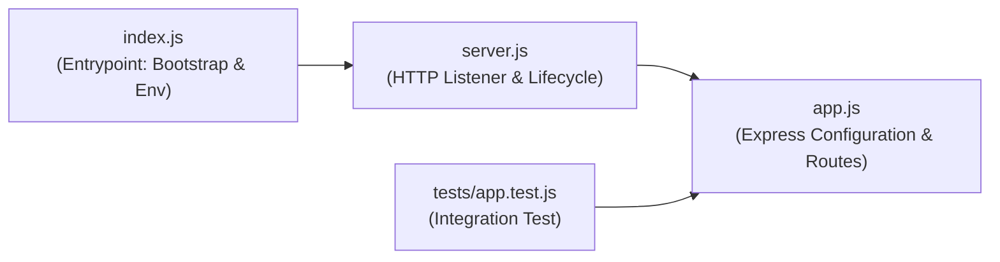
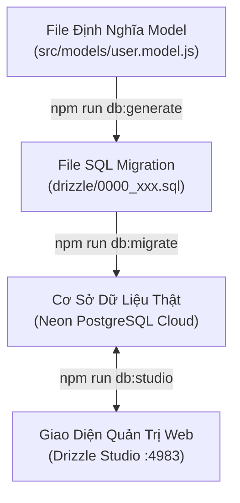
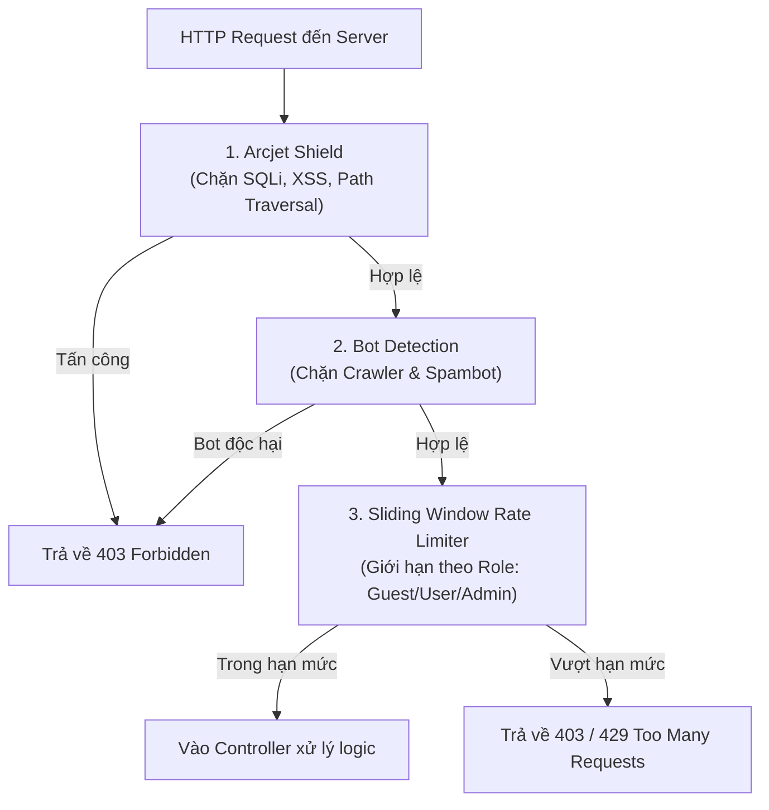
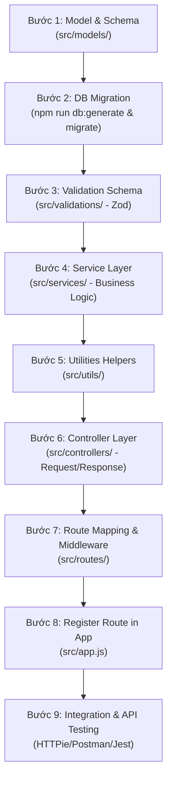

# 🚀 Hướng Dẫn Học Tập Lập Trình Web Backend Chuyên Nghiệp

_Tài liệu học tập toàn diện dựa trên quy trình thiết lập trong [demo_raw_quickstart.md](file:///e:/08_Project/Devops_Course/acquisitions/demo_raw_quickstart.md)_

Tài liệu này giải thích chi tiết toàn bộ kiến trúc, giải đáp tất cả câu hỏi kỹ thuật, phân tích sâu các thư viện bảo mật, kiểm thử, Docker, CI/CD và quy trình phát triển Web Backend hiện đại sử dụng hệ sinh thái **Modern Node.js (ES Modules), Express, Drizzle ORM, Postgres (Neon), Arcjet Security, Jest và Docker**.

---

## 📌 MỤC LỤC TỔNG QUAN

1. [Cấu Trúc Thư Mục Dự Án & Kiến Trúc Phân Lớp (Layered Architecture)](#1-cấu-trúc-thư-mục-dự-án--kiến-trúc-phân-lớp-layered-architecture)
2. [Giải Đáp Chi Tiết Toàn Bộ Câu Hỏi Kỹ Thuật Trong Quickstart](#2-giải-đáp-chi-tiết-toàn-bộ-câu-hỏi-kỹ-thuật-trong-quickstart)
   - [Câu 1: Lệnh `--watch` là gì và có tác dụng gì?](#-câu-hỏi-1-lệnh---watch-là-gì-và-có-tác-dụng-gì)
   - [Câu 2: `type: "module"` trong `package.json` (ES Modules vs CommonJS)](#-câu-hỏi-2-type-module-trong-packagejson-es-modules-vs-commonjs)
   - [Câu 3: Cờ `-D` nghĩa là gì trong `npm install`?](#-câu-hỏi-3-cờ--d-nghĩa-là-gì-trong-lệnh-cài-đặt-npm-install)
   - [Câu 4: Thông tin "vulnerabilities" khi cài npm là gì? Có quan trọng không?](#-câu-hỏi-4-thông-tin-vulnerabilities-khi-cài-npm-là-gì-có-quan-trọng-không)
   - [Câu 5: Cơ chế hoạt động của Drizzle ORM (`db:generate`, `db:migrate`, `db:studio`)](#-câu-hỏi-5-các-lệnh-thao-tác-với-database-bằng-drizzle-hoạt-động-như-thế-nào)
   - [Câu 6: Tại sao cần `created_at` / `updated_at`? Schema Backend có khác DB thật không?](#-câu-hỏi-6-tại-sao-phải-có-created_at-và-updated_at-schema-backend-có-thể-khác-db-không)
   - [Câu 7: Subpath Imports (`#config/*`) trong `package.json`](#-câu-hỏi-7-sử-dụng-absolute-import-config-như-thế-nào-và-tại-sao)
   - [Câu 8: Extension hỗ trợ lập trình Web tốt nhất](#-câu-hỏi-8-extension-nào-hỗ-trợ-gợi-ý-thư-viện-và-hàm-tốt-nhất)
   - [Câu 9: Sửa lỗi kết nối `database.js` khi chạy Docker Dev & Cơ chế Neon Local](#-câu-hỏi-9-sửa-lỗi-kết-nối-databasejs-khi-chạy-docker-dev--cơ-chế-neon-local)
   - [Câu 10: Tại sao dùng Local DB cho Dev? Luồng dữ liệu thay đổi như thế nào?](#-câu-hỏi-10-tại-sao-cần-dùng-local-cho-dev-luồng-dữ-liệu-thay-đổi-ở-đâu)
   - [Câu 11: Lỗ hổng nâng quyền (Privilege Escalation) khi nhận `role = 'admin'` và cách phòng chống](#-câu-hỏi-11-lỗ-hổng-nâng-quyền-privilege-escalation-khi-nhận-role--admin-và-cách-phòng-chống)
   - [Câu 12: File `tests/app.test.js` làm gì? Kiểm thử tự động với Jest & Supertest](#-câu-hỏi-12-file-testsapptestjs-làm-gì-kiểm-thử-tự-động-với-jest--supertest)
   - [Câu 13: Cấu hình GitHub Actions Secrets & Docker Hub Deployment](#-câu-hỏi-13-cấu-hình-github-actions-secrets--docker-hub-deployment)
3. [Phân Tích Sâu Các Thư Viện Cốt Lõi & Framework Bảo Mật (Arcjet, Zod, JWT)](#3-phân-tích-sâu-các-thư-viện-cốt-lõi--framework-bảo-mật)
4. [Bảo Mật Hệ Thống & Ma Trận Phân Quyền (RBAC Matrix)](#4-bảo-mật-hệ-thống--ma-trận-phân-quyền-rbac-matrix)
5. [Quy Trình Phát Triển Tính Năng Chuẩn (9 Bước Bottom-Up Workflow)](#5-quy-trình-phát-triển-tính-năng-chuẩn-9-bước-bottom-up-workflow)
6. [Tư Duy Kiến Trúc & VibeCoding (Architecture First, Implement by AI)](#6-tư-duy-kiến-trúc--vibecoding-architecture-first-implement-by-ai)
7. [Lộ Trình Mở Rộng Tương Lai (Future Roadmap)](#7-lộ-trình-mở-rộng-tương-lai-future-roadmap)
8. [Kinh Nghiệm & Lưu Ý Thực Chiến Khi Kiểm Thử API Bằng Postman](#8-kinh-nghiệm--lưu-ý-thực-chiến-khi-kiểm-thử-api-bằng-postman)

---

## 📂 1. Cấu Trúc Thư Mục Dự Án & Kiến Trúc Phân Lớp (Layered Architecture)

Khi xây dựng một ứng dụng Web Backend chuyên nghiệp, việc tổ chức thư mục theo kiến trúc phân lớp (Layered Architecture) giúp mã nguồn dễ bảo trì, mở rộng và kiểm thử độc lập.

```text
acquisitions/ (Thư mục gốc của dự án)
├── .dockerignore           # Chỉ định các file/thư mục Docker cần bỏ qua khi build image
├── .env                    # Lưu trữ các biến môi trường nhạy cảm (DB URL, JWT Secret, port...)
├── .env.development        # Cấu hình môi trường phát triển (Docker + Neon Local)
├── .env.production         # Cấu hình môi trường vận hành Production thật
├── .gitignore              # Chỉ định các file/thư mục Git cần bỏ qua (node_modules, .env...)
├── .prettierignore         # Chỉ định các file Prettier không format
├── .prettierrc             # Cấu hình quy tắc định dạng code của Prettier
├── drizzle.config.js       # Cấu hình Drizzle Kit (schema path, migrations output, DB credentials)
├── eslint.config.js        # Cấu hình quy tắc kiểm tra code của ESLint (ESLint v9 Flat Config)
├── jest.config.mjs         # Cấu hình kiểm thử tự động với Jest
├── package.json            # Quản lý dependencies, imports alias và scripts chạy lệnh
├── Dockerfile              # Cấu hình Multi-stage Docker Image (base, dev, prod)
├── docker-compose.dev.yml  # Docker Compose cho môi trường Dev (App + Neon Local Proxy)
├── docker-compose.prod.yml # Docker Compose cho môi trường Production tối ưu
├── DOCKER_SETUP.md         # Tài liệu thiết lập Docker
├── VIETNAMESE_GUIDE.md     # Hướng dẫn chi tiết cài đặt & vận hành dự án bằng tiếng Việt
├── Learning_Demo.md        # Tài liệu học tập toàn diện (file này)
├── demo_raw_quickstart.md  # Quy trình quickstart gốc
├── .github/                # Tự động hóa CI/CD với GitHub Actions
│   └── workflows/
│       ├── lint-and-format.yml        # Kiểm tra chuẩn code tự động
│       ├── tests.yml                  # Chạy test Jest tự động trên CI
│       └── docker-build-and-push.yml  # Build & đẩy Docker image lên Docker Hub
├── drizzle/                # Chứa các file SQL Migration do Drizzle Kit sinh ra
├── scripts/                # Shell scripts khởi chạy nhanh trên Linux/macOS
│   ├── dev.sh              # Script khởi động môi trường Dev
│   └── prod.sh             # Script triển khai Production
├── tests/                  # Thư mục kiểm thử tự động (Integration Tests)
│   └── app.test.js         # Test tích hợp cho API Express App
└── src/                    # Mã nguồn chính của Backend
    ├── app.js              # Khởi tạo Express app, middleware toàn cục và routes
    ├── index.js            # Entrypoint nạp biến môi trường và gọi server
    ├── server.js           # Khởi chạy HTTP Server và xử lý tắt an toàn (graceful shutdown)
    ├── config/             # Cấu hình các dịch vụ kết nối bên thứ ba
    │   ├── database.js     # Kết nối Database PostgreSQL bằng Drizzle Client
    │   ├── logger.js       # Cấu hình Winston Logger chuyên nghiệp
    │   └── arcjet.js       # Cấu hình bảo mật nâng cao Arcjet (Shield, Bot Detection, Rate Limiting)
    ├── controllers/        # Tiếp nhận HTTP Request và phản hồi HTTP Response
    │   ├── auth.controller.js  # Controller xử lý Đăng ký, Đăng nhập, Đăng xuất
    │   └── users.controller.js # Controller xử lý CRUD người dùng
    ├── middleware/         # Bộ lọc trung gian chặn trước khi vào Controller
    │   ├── auth.middleware.js     # Xác thực JWT Token & kiểm tra quyền hạn (Role)
    │   └── security.middleware.js # Middleware bảo vệ Arcjet Security
    ├── models/             # Định nghĩa Database Schema (Bảng dữ liệu)
    │   └── user.model.js   # Cấu trúc bảng users (id, name, email, password, role...)
    ├── routes/             # Khai báo endpoint URL (Routing)
    │   ├── auth.routes.js  # Các route `/api/auth/signup`, `/api/auth/sign-in`...
    │   └── users.routes.js # Các route `/api/users`, `/api/users/:id`...
    ├── services/           # Chứa toàn bộ Business Logic và thao tác CSDL
    │   ├── auth.service.js  # Logic băm mật khẩu, tạo user, đối chiếu mật khẩu
    │   └── users.service.js # Logic truy vấn CRUD bảng users
    ├── utils/              # Các hàm tiện ích dùng chung
    │   ├── cookies.js      # Tiện ích ghi/xóa HttpOnly Cookie an toàn
    │   ├── format.js       # Tiện ích chuẩn hóa định dạng JSON Response & Validation Errors
    │   └── jwt.js          # Tiện ích ký (sign) và xác thực (verify) JWT Token
    └── validations/        # Schema kiểm tra dữ liệu đầu vào bằng Zod
        ├── auth.validation.js  # Validate dữ liệu đăng ký/đăng nhập
        └── users.validation.js # Validate dữ liệu cập nhật người dùng
```

---

### Sự khác biệt giữa `app.js`, `server.js` và `index.js` trong thư mục `src/`



1. **`app.js` (Tạo và Cấu hình Ứng dụng)**:
   - **Nhiệm vụ**: Khởi tạo thực thể `express()`, tích hợp middleware toàn cục (CORS, Helmet, Logger, Cookie Parser, Arcjet), cấu hình định tuyến (routes) và xử lý route 404.
   - _Lợi ích kiến trúc_: Giúp file `app.js` có thể được import trực tiếp vào các bài test (Supertest/Jest) để kiểm thử API mà không cần thực sự mở port mạng trên máy.
2. **`server.js` (Giám sát và Khởi chạy Server)**:
   - **Nhiệm vụ**: Đảm nhận việc gọi `app.listen(PORT)`, quản lý vòng đời của HTTP Server, lắng nghe các sự kiện hệ thống (`SIGTERM`, `SIGINT`) để thực hiện tắt an toàn (Graceful Shutdown) tránh mất dữ liệu đang xử lý dở.
3. **`index.js` (Điểm bắt đầu - Entry Point)**:
   - **Nhiệm vụ**: Điểm bắt đầu của ứng dụng khi chạy lệnh `node src/index.js`. File này nạp cấu hình môi trường từ `dotenv`, kiểm tra các kết nối ban đầu và sau đó import `server.js` để khởi động toàn bộ hệ thống.

---

## 🛠️ 2. Giải Đáp Chi Tiết Toàn Bộ Câu Hỏi Kỹ Thuật Trong Quickstart

### ❓ Câu hỏi 1: Lệnh `--watch` là gì và có tác dụng gì?

```json
"scripts": {
  "dev": "node --watch src/index.js"
}
```

- **Bản chất**: Trước Node.js 18/20, lập trình viên bắt buộc phải cài đặt thư viện bên thứ ba như `nodemon` để tự động restart server mỗi khi sửa code.
- **Tác dụng**: Cờ `--watch` là tính năng **nội sinh (built-in native)** của Node.js. Node.js sẽ tự động theo dõi cây thư mục và các module được import. Mỗi khi bạn lưu file (`Ctrl + S`), tiến trình sẽ tự khởi động lại ngay lập tức giúp tiết kiệm thời gian phát triển mà không làm tăng dung lượng `node_modules`.

---

### ❓ Câu hỏi 2: `type: "module"` trong `package.json` (ES Modules vs CommonJS)

```json
{
  "type": "module"
}
```

- **Bản chất**: Node.js trong quá khứ mặc định sử dụng hệ thống module **CommonJS** (`require()` và `module.exports`).
- **Ý nghĩa của `type: "module"`**: Báo cho Node.js biết dự án sử dụng chuẩn **ES Modules (ECMAScript Modules)** hiện đại:
  - Sử dụng cú pháp `import { db } from '#config/database.js'` và `export default app`.
  - Hỗ trợ tính năng **Top-Level Await** (dùng trực tiếp từ khóa `await` ở ngoài cùng file mà không cần bọc trong hàm `async`).
  - Tối ưu hóa **Tree-Shaking** (loại bỏ code thừa khi đóng gói ứng dụng).
  - Đồng nhất cú pháp viết code giữa Frontend (React/Vue/Next.js) và Backend.

---

### ❓ Câu hỏi 3: Cờ `-D` nghĩa là gì trong lệnh cài đặt `npm install`?

```bash
npm install eslint @eslint/js prettier eslint-config-prettier eslint-plugin-prettier -D
```

- **Trả lời**: `-D` là viết tắt của `--save-dev`.
- **Ý nghĩa**: Phân loại gói thư viện vào nhóm `devDependencies` trong `package.json`:
  - **Dependencies (`npm install <package>`)**: Các thư viện bắt buộc để ứng dụng chạy ở môi trường Production (ví dụ: `express`, `drizzle-orm`, `bcrypt`, `@arcjet/node`).
  - **DevDependencies (`npm install <package> -D`)**: Các công cụ chỉ phục vụ quá trình viết code, kiểm tra chất lượng (Linter) hoặc kiểm thử tự động tại máy phát triển (ví dụ: `eslint`, `prettier`, `jest`, `supertest`, `drizzle-kit`). Khi triển khai lên Production với Docker qua lệnh `npm ci --only=production`, các gói này sẽ bị loại bỏ hoàn toàn, giúp Docker Image nhẹ và an toàn hơn.

---

### ❓ Câu hỏi 4: Thông tin "vulnerabilities" khi cài npm là gì? Có quan trọng không?

_Ví dụ thông báo:_ `29 vulnerabilities (1 low, 17 moderate, 11 high)`

- **Bản chất**: npm tự động chạy công cụ quét bảo mật nội bộ (`npm audit`) đối chiếu với cơ sở dữ liệu lỗi bảo mật đã công bố (CVE).
- **Tầm quan trọng**: **CỰC KỲ QUAN TRỌNG**. Các lỗ hổng cấp `High` hoặc `Critical` có thể mở đường cho hacker tấn công từ chối dịch vụ (DoS), tiêm mã độc từ xa (RCE) hoặc đánh cắp dữ liệu.
- **Cách khắc phục**:
  1. Chạy `npm audit` để xem chi tiết package nào đang dính lỗi.
  2. Chạy `npm audit fix` để npm tự động nâng cấp các package lên phiên bản bản vá an toàn mà không phá vỡ tính tương thích.
  3. Đối với các lỗi lớn yêu cầu đổi phiên bản chính (Major version), cần kiểm tra kỹ changelog trước khi chạy `npm audit fix --force`.

---

### ❓ Câu hỏi 5: Các lệnh thao tác với Database bằng Drizzle hoạt động như thế nào?

Drizzle ORM là ORM hiện đại theo triết lý **Code-First & SQL-Like**:



1. **`npm run db:generate` (Tạo file Migration)**:
   - Drizzle Kit đọc các file định nghĩa bảng trong `src/models/`, so sánh với snapshot lịch sử cũ và tự động sinh ra file SQL Migration trong thư mục `drizzle/`. **Lệnh này chưa chạm vào cơ sở dữ liệu thật.**
2. **`npm run db:migrate` (Thực thi Migration)**:
   - Drizzle Kit đọc các file SQL vừa sinh và thực thi câu lệnh SQL trực tiếp lên cơ sở dữ liệu PostgreSQL (Neon Cloud hoặc Local) dựa theo `DATABASE_URL`. Lúc này các bảng, cột, kiểu dữ liệu mới thực sự được tạo ra trên Database.
3. **`npm run db:studio` (Giao diện Quản trị Trực quan)**:
   - Khởi chạy một Web Server nội bộ (mặc định tại `localhost:4983`) cung cấp giao diện trực quan cực mạnh giúp xem dữ liệu, lọc bản ghi, chỉnh sửa và xóa trực tiếp mà không cần cài thêm DBeaver hay pgAdmin.

---

### ❓ Câu hỏi 6: Tại sao phải có `created_at` và `updated_at`? Schema Backend có thể khác DB không?

```javascript
created_at: timestamp().defaultNow().notNull(),
updated_at: timestamp().defaultNow().notNull(),
```

- **Tại sao bắt buộc phải có?**
  - **Audit Log (Lịch sử dữ liệu)**: Giúp truy vết bản ghi được tạo ra vào thời điểm nào và thay đổi lần cuối khi nào.
  - **Sắp xếp & Phân trang**: Giúp truy vấn danh sách mới nhất (`ORDER BY created_at DESC`).
  - **Caching & Đồng bộ hóa**: Phục vụ cơ chế kiểm tra `Last-Modified` hoặc `ETag` giúp Client/CDN không cần tải lại dữ liệu nếu `updated_at` không đổi.
- **Schema ở Backend và Database thật có thể khác nhau không?**
  - **Về mặt kỹ thuật, có thể khác**. Schema ở Backend là cách JavaScript mô hình hóa dữ liệu, còn DB là nơi lưu trữ vật lý.
  - **Tuy nhiên**: Nếu có sự sai lệch (ví dụ: Backend gọi cột `email` nhưng trong DB lại đặt tên là `user_email`), ứng dụng sẽ bị **lỗi Crash Runtime** ngay khi thực hiện truy vấn. Do đó, việc luôn sử dụng migration (`drizzle-kit`) đảm bảo Schema ở Backend và Database thật luôn đồng bộ 100%.

---

### ❓ Câu hỏi 7: Sử dụng Absolute Import (`#config/*`) như thế nào và tại sao?

Khi dự án phát triển lớn, việc dùng đường dẫn tương đối (Relative Path) sẽ rất rối rắm:

```javascript
// ❌ Rất khó đọc, dễ nhầm lẫn và lỗi khi di chuyển file
import { db } from '../../../../config/database.js';
```

Thay vào đó, Node.js hỗ trợ tính năng tiêu chuẩn **Subpath Imports** thông qua trường `imports` trong `package.json`:

```json
{
  "imports": {
    "#src/*": "./src/*",
    "#config/*": "./src/config/*",
    "#controllers/*": "./src/controllers/*",
    "#middleware/*": "./src/middleware/*",
    "#models/*": "./src/models/*",
    "#routes/*": "./src/routes/*",
    "#services/*": "./src/services/*",
    "#utils/*": "./src/utils/*",
    "#validations/*": "./src/validations/*"
  }
}
```

- **Cách sử dụng**:

```javascript
// ✅ Rõ ràng, nhất quán, di chuyển file đến bất kỳ đâu cũng không bị hỏng đường dẫn
import { db } from '#config/database.js';
import { users } from '#models/user.model.js';
```

> [!NOTE]
> Bắt buộc phải có tiền tố `#` ở đầu theo đúng chuẩn của Node.js để phân biệt với các thư viện trong `node_modules`.

---

### ❓ Câu hỏi 8: Extension nào hỗ trợ gợi ý thư viện và hàm tốt nhất?

1. **GitHub Copilot / Tabnine**: Trợ lý AI gợi ý code thông minh theo ngữ cảnh.
2. **ESLint & Prettier - Code formatter**: Tự động phát hiện lỗi và format code chuẩn chỉnh khi nhấn `Ctrl + S`.
3. **Auto Import & Path Intellisense**: Tự động tìm kiếm file và gợi ý đường dẫn imports.
4. **REST Client / Thunder Client**: Cho phép gửi request kiểm thử API ngay trong VS Code.
5. **Docker Extension**: Trực quan hóa container, image và volumes trên VS Code.

---

### ❓ Câu hỏi 9: Sửa lỗi kết nối `database.js` khi chạy Docker Dev & Cơ chế Neon Local

_Trong Quickstart có câu hỏi: "thấy bị lỗi khi dùng auth/sign-in. Sửa lại database.js cho phù hợp (đây là đang sửa gì? mà sau đó chạy sẽ thành công)?"_

#### Phân tích nguyên nhân lỗi:

Thư viện `@neondatabase/serverless` được thiết kế để kết nối trực tiếp với Neon Cloud qua giao thức HTTPS bảo mật (`https://...neon.tech`). Tuy nhiên, khi bạn chạy môi trường Docker Development với Docker Compose, hệ thống sử dụng một container proxy nội bộ có tên là `neon-local` (lắng nghe tại cổng `5432` hoặc endpoint HTTP nội bộ).

Nếu không cấu hình lại, driver Neon sẽ cố gắng gửi request ra Cloud theo chuẩn TLS bảo mật và bị **lỗi từ chối kết nối (Connection Refused/SSL Error)** khi chạy qua container local.

#### Cách khắc phục trong [`src/config/database.js`](file:///e:/08_Project/Devops_Course/acquisitions/src/config/database.js):

```javascript
import 'dotenv/config';
import { neon, neonConfig } from '@neondatabase/serverless';
import { drizzle } from 'drizzle-orm/neon-http';

// Cấu hình đặc biệt khi chạy môi trường development (Docker / Local Proxy)
if (process.env.NODE_ENV === 'development') {
  neonConfig.fetchEndpoint = 'http://neon-local:5432/sql'; // Trỏ endpoint HTTP về container neon-local
  neonConfig.useSecureWebSocket = false; // Tắt bắt buộc mã hóa SSL cho local proxy
  neonConfig.poolQueryViaFetch = true; // Chuyển truy vấn sang cơ chế HTTP Fetch
}

const sql = neon(process.env.DATABASE_URL);
const db = drizzle(sql);

export { db, sql };
```

_Nhờ đoạn mã trên, ứng dụng tự động nhận diện môi trường development để kết nối thông suốt với `neon-local`, giúp các API `auth/signup`, `auth/sign-in` hoạt động hoàn hảo._

---

### ❓ Câu hỏi 10: Tại sao cần dùng Local cho Dev? Luồng dữ liệu thay đổi ở đâu?

_Trong Quickstart có câu hỏi: "tại sao cần dùng local cho dev? nếu dùng local thì luồng dữ liệu ở đâu thay đổi?"_

| Tiêu chí            | Môi trường Dev (Neon Local / Docker)                                                    | Môi trường Production (Neon Cloud)                      |
| :------------------ | :-------------------------------------------------------------------------------------- | :------------------------------------------------------ |
| **Cơ sở dữ liệu**   | Tạo nhánh cơ sở dữ liệu tạm thời (Ephemeral Branch) ánh xạ qua `.neon_local/`           | Database chính thức lưu trên cụm máy chủ Cloud của Neon |
| **Tốc độ truy vấn** | Cực nhanh vì truy vấn qua mạng nội bộ Docker                                            | Phụ thuộc vào tốc độ đường truyền internet quốc tế      |
| **Tính độc lập**    | Nhiều lập trình viên có thể test dữ liệu rác, xóa bảng mà không sợ ảnh hưởng người khác | Dữ liệu thật của khách hàng, được bảo vệ nghiêm ngặt    |
| **Luồng dữ liệu**   | Dữ liệu được ghi vào proxy cục bộ và nhánh test tạm thời                                | Dữ liệu được ghi vĩnh viễn vào cụm Postgres Production  |

- **Luồng dữ liệu thay đổi như thế nào?**
  - Trong môi trường Dev: Khi bạn tạo user mới ở `http://localhost:3000`, request đi tới `acquisitions-app-dev` -> chuyển qua proxy `acquisitions-neon-local` -> ghi dữ liệu vào snapshot branch test.
  - Trong môi trường Prod: Request đi tới `acquisitions-app-prod` -> kết nối trực tiếp chuỗi URL Neon Cloud (`DATABASE_URL`) -> lưu vĩnh viễn vào hệ thống Cloud.

---

### ❓ Câu hỏi 11: Lỗ hổng nâng quyền (Privilege Escalation) khi nhận `role = 'admin'` và cách phòng chống

_Trong Quickstart có câu hỏi: "khi test thấy role = 'admin' chỉnh được lúc tạo vậy thì có người nào ở giữa thay đổi role để thay đổi quyền hạn thì sao? có cách nào hạn chế không?"_

#### Phân tích lỗ hổng (Mass Assignment / Privilege Escalation):

Trong file [`src/validations/auth.validation.js`](file:///e:/08_Project/Devops_Course/acquisitions/src/validations/auth.validation.js), schema đăng ký hiện tại định nghĩa:

```javascript
export const signupSchema = z.object({
  name: z.string().min(2).max(255).trim(),
  email: z.email().max(255).toLowerCase().trim(),
  password: z.string().min(6).max(128),
  role: z.enum(['user', 'admin']).default('user'), // ⚠️ LỖ HỔNG BẢO MẬT TẠI ĐÂY
});
```

- **Kịch bản tấn công**: Một người dùng thông thường gửi HTTP POST tới `/api/auth/signup` kèm body:
  ```json
  {
    "name": "Hacker",
    "email": "hacker@evil.com",
    "password": "password123",
    "role": "admin"
  }
  ```
  Do schema Zod cho phép nhận trường `role`, tài khoản này sẽ được tạo với quyền **`admin`**, lập tức có toàn quyền truy cập các API xóa dữ liệu (`DELETE /api/users/:id`) hoặc xem thông tin toàn bộ người dùng!

#### 3 Giải pháp phòng chống chuẩn doanh nghiệp:

1. **Giải pháp 1: Loại bỏ trường `role` khỏi schema đăng ký công khai (Khuyến nghị)**:
   ```javascript
   // src/validations/auth.validation.js
   export const signupSchema = z.object({
     name: z.string().min(2).max(255).trim(),
     email: z.email().max(255).toLowerCase().trim(),
     password: z.string().min(6).max(128),
     // Tuyệt đối không cho client truyền role lên khi tự đăng ký
   });
   ```
2. **Giải pháp 2: Gán cứng quyền mặc định tại Service Layer**:
   ```javascript
   // src/services/auth.service.js
   export const createUser = async ({ name, email, password }) => {
     // Luôn gán cứng role là 'user', bất kể client gửi gì lên
     const [newUser] = await db
       .insert(users)
       .values({
         name,
         email,
         password: password_hash,
         role: 'user',
       })
       .returning();
   };
   ```
3. **Giải pháp 3: Tạo API riêng biệt để thăng cấp quyền (Admin-Only Promotion Endpoint)**:
   - Chỉ có tài khoản có quyền `admin` hoặc `superadmin` mới được gọi API `PUT /api/users/:id/role` để thay đổi vai trò của người khác.

---

### ❓ Câu hỏi 12: File `tests/app.test.js` làm gì? Kiểm thử tự động với Jest & Supertest

_Trong Quickstart có câu hỏi: "tạo tests/app.test.js: file này làm gì? các nội dung trong đây?"_

#### Mục đích của file [`tests/app.test.js`](file:///e:/08_Project/Devops_Course/acquisitions/tests/app.test.js):

Đây là file **Kiểm thử tích hợp (Integration Test)**. Sử dụng thư viện **Supertest** để gửi request HTTP giả lập trực tiếp vào ứng dụng Express (`app`) mà không cần tốn tài nguyên khởi động HTTP Server thật trên cổng mạng.

#### Chi tiết các ca kiểm thử trong file:

```javascript
import request from 'supertest';
import app from '#src/app.js';

describe('API Endpoints', () => {
  // Test 1: Kiểm tra endpoint kiểm tra sức khỏe hệ thống
  describe('GET /health', () => {
    it('should return health status', async () => {
      const response = await request(app).get('/health').expect(200);
      expect(response.body).toHaveProperty('status', 'OK');
      expect(response.body).toHaveProperty('timestamp');
      expect(response.body).toHaveProperty('uptime');
    });
  });

  // Test 2: Kiểm tra endpoint API gốc
  describe('GET /api', () => {
    it('should return API message', async () => {
      const response = await request(app).get('/api').expect(200);
      expect(response.body).toHaveProperty(
        'message',
        'Acquisitions API is running!'
      );
    });
  });

  // Test 3: Kiểm tra cơ chế xử lý khi gọi route không tồn tại (404 Handler)
  describe('GET /nonexistent', () => {
    it('should return 404 for non-existent routes', async () => {
      const response = await request(app).get('/nonexistent').expect(404);
      expect(response.body).toHaveProperty('error', 'Route not found');
    });
  });
});
```

#### Tại sao `package.json` cần script `"test": "NODE_OPTIONS=--experimental-vm-modules jest"`?

Vì Jest ra đời từ thời CommonJS, khi dự án được cấu hình `"type": "module"` (ES Modules), Jest cần cờ `--experimental-vm-modules` của Node.js để có thể nạp và thực thi các câu lệnh `import/export` mà không bị lỗi cú pháp.

---

### ❓ Câu hỏi 13: Cấu hình GitHub Actions Secrets & Docker Hub Deployment

_Trong Quickstart có đề cập: "đọc yêu cầu để chạy actions github là required secrets..."_

Để quy trình CI/CD tự động trong [`.github/workflows/docker-build-and-push.yml`](file:///e:/08_Project/Devops_Course/acquisitions/.github/workflows/docker-build-and-push.yml) có thể đóng gói Docker Image và tải lên Docker Hub, bạn cần khai báo các biến bảo mật (Repository Secrets) trên GitHub:

| Tên Secret trên GitHub  | Ý nghĩa và nguồn lấy                                                             |
| :---------------------- | :------------------------------------------------------------------------------- |
| **`DOCKER_USERNAME`**   | Tên tài khoản đăng nhập trên [Docker Hub](https://hub.docker.com/)               |
| **`DOCKER_PASSWORD`**   | **Personal Access Token (PAT)** được sinh từ Docker Hub (Cấp quyền Read & Write) |
| **`TEST_DATABASE_URL`** | Chuỗi kết nối PostgreSQL dùng riêng cho bài kiểm thử tự động trên CI runner      |
| **`NODE_ENV`**          | Giá trị cấu hình môi trường, đặt là `production`                                 |

#### Quy trình tạo Personal Access Token trên Docker Hub:

1. Đăng nhập [hub.docker.com](https://hub.docker.com/) -> Nhấp vào hình đại diện góc trên bên phải -> Chọn **Account Settings**.
2. Chọn mục **Personal access tokens** -> Nhấn nút **Generate new token**.
3. Đặt mô tả tên (ví dụ: `github-actions-acquisitions`) và chọn phân quyền **Access permissions** là `Read, Write, Delete`.
4. Nhấn **Generate** và sao chép mã Token để dán vào Secret `DOCKER_PASSWORD` trên GitHub.

---

## 🛡️ 3. Phân Tích Sâu Các Thư Viện Cốt Lõi & Framework Bảo Mật

### Bảng tổng quan các thư viện chính trong dự án

| Thư viện                       | Phân loại            | Vai trò kỹ thuật trong hệ thống                                                   |
| :----------------------------- | :------------------- | :-------------------------------------------------------------------------------- |
| **`express`** (v5)             | Web Framework        | Xử lý Routing, điều phối Middleware và Request/Response.                          |
| **`@arcjet/node`**             | Security Framework   | Bảo mật đa tầng: Arcjet Shield, Bot Detection, Sliding Window Rate Limiting.      |
| **`drizzle-orm`**              | TypeScript/JS ORM    | ORM nhẹ, nhanh, an toàn kiểu dữ liệu, tương thích tối đa với Serverless Postgres. |
| **`drizzle-kit`**              | Migration Tool       | Sinh mã SQL Migration và cung cấp giao diện quản trị Drizzle Studio.              |
| **`@neondatabase/serverless`** | Database Driver      | Driver kết nối Postgres được tối ưu hóa cho môi trường Serverless Cloud.          |
| **`zod`**                      | Data Validation      | Khai báo và xác thực cấu trúc dữ liệu đầu vào (Input Schema Validation).          |
| **`bcrypt`**                   | Password Hashing     | Mã hóa mật khẩu một chiều bằng thuật toán băm kèm muối (Salted Hash).             |
| **`jsonwebtoken`**             | Stateless Auth       | Sinh và giải mã Token JWT phục vụ xác thực người dùng.                            |
| **`helmet`**                   | HTTP Security        | Tự động thêm các Security Headers bảo vệ ứng dụng (chống XSS, Clickjacking).      |
| **`cookie-parser`**            | Cookie Parser        | Phân tích HTTP Cookie Header thành đối tượng `req.cookies`.                       |
| **`winston` & `morgan`**       | Logging & Monitoring | Ghi log hệ thống và log lưu lượng truy cập HTTP ra console/file.                  |
| **`jest` & `supertest`**       | Automated Testing    | Chạy Unit Test và Integration Test tự động cho Express App.                       |

---

### Phân Tích Chi Tiết Framework Bảo Mật Arcjet

Trong file [`src/config/arcjet.js`](file:///e:/08_Project/Devops_Course/acquisitions/src/config/arcjet.js) và [`src/middleware/security.middleware.js`](file:///e:/08_Project/Devops_Course/acquisitions/src/middleware/security.middleware.js), hệ thống thiết lập 3 lớp bảo vệ thời gian thực:



1. **`shield({ mode: 'LIVE' })`**:
   - Phân tích luồng request để phát hiện và ngăn chặn ngay lập tức các mẫu tấn công phổ biến như SQL Injection, Cross-Site Scripting (XSS), Directory Traversal và SSRF.
2. **`detectBot({ mode: 'LIVE', allow: ['CATEGORY:SEARCH_ENGINE'] })`**:
   - Nhận diện dấu vân tay (fingerprint) của client. Tự động cho phép các bot tìm kiếm hợp pháp (GoogleBot, BingBot) đi qua và chặn các crawler tự động, bot quét lỗ hổng hoặc spammer.
3. **`slidingWindow` (Cửa Sổ Trượt Theo Từng Vai Trò)**:
   - Khác với thuật toán Fixed Window (dễ bị bùng nổ request ở thời điểm giao thoa giữa các phút), thuật toán **Sliding Window** tính toán tần suất liên tục và mượt mà:
     - **Guest (Chưa đăng nhập)**: Giới hạn tối đa **5 requests / phút**.
     - **User (Người dùng thường)**: Giới hạn tối đa **10 requests / phút**.
     - **Admin (Quản trị viên)**: Giới hạn tối đa **20 requests / phút**.

---

## 🔒 4. Bảo Mật Hệ Thống & Ma Trận Phân Quyền (RBAC Matrix)

### Ma Trận Phân Quyền (Role-Based Access Control)

| Endpoint             |  Method  | Guest (Chưa login)  |          User Thường          |      Admin       |
| :------------------- | :------: | :-----------------: | :---------------------------: | :--------------: |
| `/health`            |  `GET`   |     ✅ Cho phép     |          ✅ Cho phép          |   ✅ Cho phép    |
| `/api/auth/signup`   |  `POST`  |     ✅ Cho phép     |          ✅ Cho phép          |   ✅ Cho phép    |
| `/api/auth/sign-in`  |  `POST`  |     ✅ Cho phép     |          ✅ Cho phép          |   ✅ Cho phép    |
| `/api/auth/sign-out` |  `POST`  |     ✅ Cho phép     |          ✅ Cho phép          |   ✅ Cho phép    |
| `/api/users`         |  `GET`   | ❌ 401 Unauthorized |       ❌ 403 Forbidden        |  ✅ **200 OK**   |
| `/api/users/:id`     |  `GET`   | ❌ 401 Unauthorized |          ✅ Cho phép          |   ✅ Cho phép    |
| `/api/users/:id`     |  `PUT`   | ❌ 401 Unauthorized | ✅ Chỉ sửa tài khoản của mình | ✅ Sửa bất kỳ ai |
| `/api/users/:id`     | `DELETE` | ❌ 401 Unauthorized |       ❌ 403 Forbidden        |  ✅ **200 OK**   |

---

### Cơ Chế Xác Thực Bằng HttpOnly Cookie

Thay vì lưu JWT Token trong `localStorage` của trình duyệt (rất dễ bị đánh cắp nếu trang web dính lỗi XSS), dự án sử dụng cơ chế **HttpOnly Cookie**:

```javascript
// src/utils/cookies.js
export const cookies = {
  set: (res, name, value) => {
    res.cookie(name, value, {
      httpOnly: true, // JavaScript phía trình duyệt KHÔNG THỂ đọc được -> Chống XSS
      secure: process.env.NODE_ENV === 'production', // Chỉ gửi qua HTTPS ở môi trường Production
      sameSite: 'strict', // Chống tấn công CSRF (Cross-Site Request Forgery)
      maxAge: 24 * 60 * 60 * 1000, // Hạn sử dụng 1 ngày
    });
  },
  clear: (res, name) => {
    res.clearCookie(name);
  },
};
```

---

## 🔄 5. Quy Trình Phát Triển Tính Năng Chuẩn (9 Bước Bottom-Up Workflow)

Khi xây dựng bất kỳ tính năng mới nào trong Backend, hãy luôn tuân thủ quy trình 9 bước từ dưới lên (Database -> Router):



---

## 💡 6. Tư Duy Kiến Trúc & VibeCoding (Architecture First, Implement by AI)

Trong kỷ nguyên AI Coding (sử dụng Cursor, Warp, Antigravity...), phương pháp làm việc hiệu quả nhất của một Kỹ sư Backend là:

> [!IMPORTANT]
> **"Focus on Architecture, Let AI Implement & Debug"**
>
> - **Vai trò của bạn (Architect & Security Master)**:
>   - Thiết kế luồng dữ liệu (Data Flow) và cấu trúc bảng (Schema Design).
>   - Xác định ma trận phân quyền (RBAC Matrix) và chiến lược bảo mật (Rate limit, Cookie HttpOnly).
>   - Cấu hình môi trường (Docker Compose, GitHub Actions CI/CD).
> - **Vai trò của AI Agent**:
>   - Sinh code chi tiết (Controllers, Services, Validations).
>   - Viết các bài kiểm thử tự động (Unit & Integration Tests).
>   - Đọc log lỗi và đề xuất bản vá khi gặp sự cố cú pháp hoặc tương thích phiên bản.

---

## 🚀 7. Lộ Trình Mở Rộng Tương Lai (Future Roadmap)

1. **Phát triển toàn diện nghiệp vụ Acquisitions**:
   - Xây dựng bảng `acquisitions` liên kết với `users`.
   - Tạo API ghi nhận thương vụ mua lại doanh nghiệp, quản lý trạng thái đàm phán (`negotiating`, `closed`, `cancelled`), định giá và doanh thu.
2. **Triển khai Hạ Tầng Kubernetes (K8s)**:
   - Tạo các manifest `Deployment`, `Service`, `ConfigMap`, `Secret` và `Ingress Controller`.
   - Cấu hình Horizontal Pod Autoscaler (HPA) tự động co giãn số lượng Pods theo tải CPU/RAM.
3. **Mở rộng CI/CD Pipeline**:
   - Tích hợp tự động quét bảo mật mã nguồn (SonarQube / Snyk).
   - Tự động triển khai lên cụm Cloud Server (AWS EKS / DigitalOcean Kubernetes / Render) khi merge code vào nhánh `main`.
4. **Xây Dựng Giao Diện Người Dùng (Frontend)**:
   - Phát triển ứng dụng Web Frontend bằng React / Next.js / Tailwind CSS kết nối trực tiếp với hệ thống REST API này.

---

## 🧪 8. Kinh Nghiệm & Lưu Ý Thực Chiến Khi Kiểm Thử API Bằng Postman

Trong quá trình phát triển và kiểm thử API Backend với **Postman**, có 5 vấn đề cốt lõi mà mọi Kỹ sư Backend cần nắm vững:

### 8.1. Cơ Chế HttpOnly Cookie trong Postman (Khác gì Bearer Token?)

- **Bearer Token truyền thống**: Server trả về `{ token: "..." }`, bạn phải vào Postman copy token đó và dán vào tab `Authorization` -> `Bearer Token` ở mỗi request tiếp theo.
- **HttpOnly Cookie (Cách dự án này sử dụng)**:
  - Khi gọi `POST /api/auth/sign-up` hoặc `POST /api/auth/sign-in`, server trả về Header `Set-Cookie: token=...; HttpOnly; SameSite=Strict`.
  - **Postman tự động lưu Cookie vào Cookie Jar nội bộ**.
  - Các request tiếp theo (như `GET /api/users`) sẽ **tự động gửi kèm Cookie `token`** mà bạn không cần cấu hình thêm bất kỳ header Authorization nào.
  - **Mẹo quản lý Cookie**: Khi muốn đổi sang tài khoản khác hoặc giả lập trạng thái Chưa đăng nhập, hãy nhấn vào liên kết **Cookies** (ngay dưới nút `Send` trong Postman) -> Xóa cookie `token` của domain `localhost`.

### 8.2. Xử Lý Xung Đột Giữa Arcjet Bot Detection & Postman (Lỗi 403 `Automated requests are not allowed`)

- **Nguyên nhân**: Postman luôn tự động gửi header `User-Agent: PostmanRuntime/x.x.x`. Thư viện bảo mật **Arcjet** mặc định coi các User-Agent này là Automated Tool / Bot và chặn bằng lỗi `403 Forbidden: Automated requests are not allowed`.
- **Giải pháp chuẩn trong mã nguồn**:
  - Trong [`src/middleware/security.middleware.js`](file:///e:/08_Project/Devops_Course/acquisitions/src/middleware/security.middleware.js), chỉ áp dụng chặn Bot nghiêm ngặt khi chạy môi trường `production`.
  - Ở môi trường `development`, hệ thống tự động cho phép Postman, cURL, Insomnia và các REST client hoạt động để phục vụ việc lập trình và kiểm thử.

### 8.3. Quản Lý Arcjet Sliding Window Rate Limiting (Lỗi 403 `Too many requests`)

- **Cơ chế**: Arcjet áp dụng thuật toán **Sliding Window Rate Limiting** theo vai trò người dùng (Guest: 20 req/m, User: 30 req/m, Admin: 50 req/m).
- **Lưu ý**: Nếu bạn bấm nút `Send` liên tục trong Postman quá nhanh trong một khoảng thời gian ngắn, Arcjet sẽ tạm thời chặn request với mã `403 Forbidden` (`{"error":"Forbidden","message":"Too many requests"}`).
- **Cách xử lý**: Bạn chỉ cần đợi **30 - 60 giây** để cửa sổ trượt (sliding window) reset lại hạn mức và tiếp tục gửi request.

### 8.4. Quy Trình Hot-Reload & Restart Docker Khi Đang Test Postman

- **Khi sửa code JavaScript (`src/`)**: Docker container chạy với lệnh `node --watch` và mount thư mục máy chủ (`volumes: .:/app`). Ngay khi bạn lưu file (`Ctrl + S`), server trong container sẽ **tự reload sau 0.1 giây**, bạn có thể bấm `Send` trên Postman ngay để thấy kết quả mới mà **không cần restart container**.
- **Khi sửa biến môi trường (`.env.*`) hoặc `docker-compose.dev.yml`**: Docker chỉ nạp biến môi trường khi tạo container. Bạn cần khởi động lại:
  ```powershell
  docker compose -f docker-compose.dev.yml down
  docker compose -f docker-compose.dev.yml up -d
  ```

### 8.5. Kiểm Thử Phân Quyền RBAC (Role-Based Access Control) Trên Postman

Để kiểm tra ma trận bảo mật đã chạy đúng chưa:

1. Đăng ký tài khoản `role: "user"` -> Gọi `GET /api/users` -> Nhận đúng lỗi **`403 Forbidden: Insufficient permissions`**.
2. Đăng ký tài khoản `role: "admin"` -> Gọi `GET /api/users` -> Nhận mã **`200 OK`** cùng danh sách toàn bộ người dùng trong CSDL.
3. User chỉ sửa được thông tin của chính mình (`PUT /api/users/:id`), Admin sửa và xóa được tài khoản của người khác (`DELETE /api/users/:id`).

> [!TIP]
> **Tài Liệu Postman Collection Chi Tiết**:
> Xem toàn bộ 9 API mẫu và mã JSON Import vào Postman tại [**`POSTMAN_GUIDE.md`**](file:///e:/08_Project/Devops_Course/acquisitions/POSTMAN_GUIDE.md).
