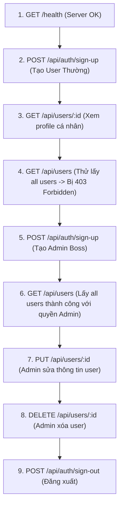

# 🚀 HƯỚNG DẪN KIỂM THỬ API BẰNG POSTMAN (POSTMAN GUIDE)

_Dự án: **Acquisitions Backend API** (Express.js + Drizzle ORM + PostgreSQL + Arcjet Security)_

---

## 📌 MỤC LỤC

1. [Chuẩn Bị & Cài Đặt Ban Đầu](#1-chuẩn-bị--cài-đặt-ban-đầu)
2. [Cơ Chế Quản Lý Cookie Token Trong Postman](#2-cơ-chế-quản-lý-cookie-token-trong-postman)
3. [Chi Tiết Toàn Bộ Endpoints](#3-chi-tiết-toàn-bộ-endpoints)
   - [Nhóm 1: Hệ Thống (System Endpoints)](#nhóm-1-hệ-thống-system-endpoints)
   - [Nhóm 2: Xác Thực & Tài Khoản (Authentication)](#nhóm-2-xác-thực--tài-khoản-authentication)
   - [Nhóm 3: Quản Lý Người Dùng & Phân Quyền (Users & RBAC)](#nhóm-3-quản-lý-người-dùng--phân-quyền-users--rbac)
4. [Kịch Bản Kiểm Thử Thực Tế Từng Bước (Step-by-Step Flow)](#4-kịch-bản-kiểm-thử-thực-tế-từng-bước-step-by-step-flow)
5. [Bảng Tra Cứu & Xử Lý Lỗi Thường Gặp Trong Postman](#5-bảng-tra-cứu--xử-lý-lỗi-thường-gặp-trong-postman)
6. [Mã JSON Collection Nhập Nhanh Vào Postman (Import Collection)](#6-mã-json-collection-nhập-nhanh-vào-postman-import-collection)

---

## 🛠️ 1. Chuẩn Bị & Cài Đặt Ban Đầu

### 1.1. Đảm bảo Server đang chạy

Trước khi test, hãy chắc chắn Docker server đang chạy tại cổng `3000`:

- Truy cập thử trên trình duyệt: `http://localhost:3000/health` -> Thấy `{"status":"OK"}`.

### 1.2. Thiết lập Biến Môi Trường (Environment) trong Postman (Khuyên dùng)

1. Mở **Postman** -> Chọn tab **Environments** (bên trái) -> Bấm **Create Environment** (đặt tên: `Acquisitions Dev`).
2. Thêm biến:
   - **VARIABLE**: `baseUrl`
   - **INITIAL VALUE**: `http://localhost:3000`
   - **CURRENT VALUE**: `http://localhost:3000`
3. Nhấn **Save** (`Ctrl + S`), sau đó ở góc trên bên phải màn hình Postman, chọn môi trường `Acquisitions Dev`.

---

## 🍪 2. Cơ Chế Quản Lý Cookie Token Trong Postman

- Dự án sử dụng **HttpOnly Cookie** có tên là `token` để xác thực JWT.
- **Đặc điểm tuyệt vời của Postman**: Khi bạn gọi API `POST /api/auth/sign-up` hoặc `POST /api/auth/sign-in`, Postman sẽ **tự động lưu Cookie `token` vào Cookie Jar**.
- Các request tiếp theo (`GET /api/users`, `PUT /api/users/:id`, v.v.) sẽ **tự động gửi kèm Cookie** này mà bạn không cần phải copy-paste token thủ công!
- **Cách xem / xóa Cookie trong Postman**:
  - Nhấn vào liên kết **Cookies** (ngay dưới nút `Send` màu xanh của Postman).
  - Bạn sẽ thấy domain `localhost` và cookie `token`. Bạn có thể xóa cookie tại đây nếu muốn test trạng thái chưa đăng nhập.

---

## 📡 3. Chi Tiết Toàn Bộ Endpoints

### Nhóm 1: Hệ Thống (System Endpoints)

#### 1.1. `GET /health` - Kiểm tra trạng thái máy chủ

- **Method**: `GET`
- **URL**: `{{baseUrl}}/health`
- **Headers**: Mặc định
- **Body**: Không có
- **Response Mẫu (200 OK)**:

```json
{
  "status": "OK",
  "timestamp": "2026-09-02T06:19:43.966Z",
  "uptime": 87.48
}
```

#### 1.2. `GET /api` - Thông tin chào mừng API

- **Method**: `GET`
- **URL**: `{{baseUrl}}/api`
- **Response Mẫu (200 OK)**:

```json
{
  "message": "Acquisitions API is running!"
}
```

---

### Nhóm 2: Xác Thực & Tài Khoản (Authentication)

#### 2.1. `POST /api/auth/sign-up` - Đăng ký tài khoản mới

- **Method**: `POST`
- **URL**: `{{baseUrl}}/api/auth/sign-up`
- **Headers**: `Content-Type: application/json`
- **Body** (chọn `raw` -> `JSON`):

```json
{
  "name": "Nguyen Van A",
  "email": "usera@example.com",
  "password": "password123",
  "role": "user"
}
```

> [!NOTE]
> `role` có thể là `"user"` hoặc `"admin"`. Nếu không truyền, mặc định là `"user"`.

- **Response Mẫu (201 Created)**:

```json
{
  "message": "User registered",
  "user": {
    "id": 1,
    "name": "Nguyen Van A",
    "email": "usera@example.com",
    "role": "user"
  }
}
```

_(Postman tự động nhận cookie `token`)_

---

#### 2.2. `POST /api/auth/sign-in` - Đăng nhập

- **Method**: `POST`
- **URL**: `{{baseUrl}}/api/auth/sign-in`
- **Headers**: `Content-Type: application/json`
- **Body** (`raw` -> `JSON`):

```json
{
  "email": "usera@example.com",
  "password": "password123"
}
```

- **Response Mẫu (200 OK) (xem trong Response body)**:

```json
{
  "message": "User authenticated successfully",
  "user": {
    "id": 1,
    "name": "Nguyen Van A",
    "email": "usera@example.com",
    "role": "user"
  }
}
```

---

#### 2.3. `POST /api/auth/sign-out` - Đăng xuất

- **Method**: `POST`
- **URL**: `{{baseUrl}}/api/auth/sign-out`
- **Response Mẫu (200 OK)**:

```json
{
  "message": "User signed out successfully"
}
```

_(Postman sẽ tự động xóa cookie `token`)_

---

### Nhóm 3: Quản Lý Người Dùng & Phân Quyền (Users & RBAC)

#### 3.1. `GET /api/users` - Lấy danh sách toàn bộ Users

- **Quyền hạn**: **Admin Only** (Chỉ tài khoản có `role: "admin"` mới gọi được).
- **Method**: `GET`
- **URL**: `{{baseUrl}}/api/users`
- **Response Thành Công (200 OK)**:

```json
{
  "message": "Successfully retrieved users",
  "users": [
    {
      "id": 1,
      "name": "Nguyen Van A",
      "email": "usera@example.com",
      "role": "user",
      "created_at": "2026-09-02T06:10:48.000Z",
      "updated_at": "2026-09-02T06:10:48.000Z"
    }
  ],
  "count": 1
}
```

- **Response Bị Chặn (403 Forbidden)** _(khi dùng tài khoản role: "user")_:

```json
{
  "error": "Access denied",
  "message": "Insufficient permissions"
}
```

---

#### 3.2. `GET /api/users/:id` - Xem chi tiết một User

- **Quyền hạn**: Đã đăng nhập (`user` hoặc `admin`).
- **Method**: `GET`
- **URL**: `{{baseUrl}}/api/users/1`
- **Response Mẫu (200 OK)**:

```json
{
  "message": "User retrieved successfully",
  "user": {
    "id": 1,
    "name": "Nguyen Van A",
    "email": "usera@example.com",
    "role": "user",
    "created_at": "2026-09-02T06:10:48.000Z",
    "updated_at": "2026-09-02T06:10:48.000Z"
  }
}
```

---

#### 3.3. `PUT /api/users/:id` - Cập nhật thông tin User

- **Quyền hạn**:
  - Tài khoản `user` chỉ sửa được thông tin của **chính mình** (không được sửa `role`).
  - Tài khoản `admin` sửa được thông tin của **mọi user** và đổi được `role`.
- **Method**: `PUT`
- **URL**: `{{baseUrl}}/api/users/1`
- **Headers**: `Content-Type: application/json`
- **Body** (`raw` -> `JSON`):

```json
{
  "name": "Nguyen Van A (Updated)",
  "email": "usera_new@example.com"
}
```

- **Response Mẫu (200 OK)**:

```json
{
  "message": "User updated successfully",
  "user": {
    "id": 1,
    "name": "Nguyen Van A (Updated)",
    "email": "usera_new@example.com",
    "role": "user",
    "updated_at": "2026-09-02T06:25:00.000Z"
  }
}
```

---

#### 3.4. `DELETE /api/users/:id` - Xóa tài khoản User

- **Quyền hạn**: **Admin Only** (Không được tự xóa chính tài khoản Admin đang đăng nhập).
- **Method**: `DELETE`
- **URL**: `{{baseUrl}}/api/users/1`
- **Response Mẫu (200 OK)**:

```json
{
  "message": "User deleted successfully",
  "user": {
    "id": 1,
    "name": "Nguyen Van A",
    "email": "usera@example.com"
  }
}
```

---

## 🔄 4. Kịch Bản Kiểm Thử Thực Tế Từng Bước (Step-by-Step Flow)

Hãy thực hiện theo thứ tự sau để kiểm thử toàn diện hệ thống:



1. **Bước 1**: Gọi `GET {{baseUrl}}/health` -> Xác nhận server hoạt động (`200`).
2. **Bước 2**: Gọi `POST {{baseUrl}}/api/auth/sign-up` tạo tài khoản `role: "user"`.
3. **Bước 3**: Gọi `GET {{baseUrl}}/api/users/1` -> Trả về thông tin chính user vừa tạo.
4. **Bước 4**: Thử gọi `GET {{baseUrl}}/api/users` -> Nhận về lỗi `403 Forbidden: Insufficient permissions` (Đúng thiết kế bảo mật RBAC).
5. **Bước 5**: Gọi `POST {{baseUrl}}/api/auth/sign-up` tạo tài khoản với `role: "admin"` (ví dụ: `email: "admin@example.com"`).
6. **Bước 6**: Gọi lại `GET {{baseUrl}}/api/users` -> Lấy thành công danh sách toàn bộ Users trong Database!
7. **Bước 7**: Gọi `PUT {{baseUrl}}/api/users/1` bằng quyền Admin để đổi tên hoặc email của user.
8. **Bước 8**: Gọi `DELETE {{baseUrl}}/api/users/1` để xóa user đó.
9. **Bước 9**: Gọi `POST {{baseUrl}}/api/auth/sign-out` để hoàn tất phiên làm việc.

---

## ⚠️ 5. Bảng Tra Cứu & Xử Lý Lỗi Thường Gặp Trong Postman

| Mã Lỗi                                  | Nguyên Nhân                                                                                           | Cách Xử Lý                                                                         |
| :-------------------------------------- | :---------------------------------------------------------------------------------------------------- | :--------------------------------------------------------------------------------- |
| **`401 Authentication required`**       | Chưa đăng nhập hoặc Cookie `token` đã hết hạn.                                                        | Gọi lại API `POST /api/auth/sign-in` để nạp Cookie mới.                            |
| **`403 Forbidden / Too many requests`** | Arcjet kích hoạt chống spam (gọi quá 5 lần/phút cho guest hoặc vượt ngưỡng).                          | Đợi khoảng 30s - 60s để bộ đếm Rate Limit tự động reset rồi gọi lại.               |
| **`403 Access denied`**                 | Bạn đang dùng tài khoản `user` thường để gọi API dành riêng cho `admin`.                              | Đăng nhập bằng tài khoản có `role: "admin"`.                                       |
| **`400 Validation failed`**             | Dữ liệu Body JSON gửi lên không đúng định dạng (ví dụ: email sai cú pháp, password ngắn hơn 6 ký tự). | Kiểm tra lại trường `details` trong response JSON để biết chính xác trường bị sai. |
| **`404 Route not found`**               | Gõ sai URL (ví dụ: thiếu chữ `/api/` hoặc sai chính tả endpoint).                                     | Kiểm tra lại URL chính xác theo bảng ở mục 3.                                      |

---

## 📥 6. Mã JSON Collection Nhập Nhanh Vào Postman (Import Collection)

Bạn chỉ cần:

1. Mở **Postman** -> Nhấn nút **Import** (ở góc trên bên trái).
2. Chọn tab **Raw text** -> Dán toàn bộ đoạn JSON bên dưới vào -> Nhấn **Import**.
3. Bạn sẽ có ngay một Collection hoàn chỉnh chứa đầy đủ 9 API với URL, Header và Body mẫu đã được cấu hình sẵn!

```json
{
  "info": {
    "_postman_id": "acquisitions-api-collection-2026",
    "name": "Acquisitions Backend API",
    "description": "Collection kiểm thử đầy đủ API dự án Acquisitions (Auth, Users, RBAC, Health)",
    "schema": "https://schema.getpostman.com/json/collection/v2.1.0/collection.json"
  },
  "item": [
    {
      "name": "1. System",
      "item": [
        {
          "name": "Health Check",
          "request": {
            "method": "GET",
            "header": [],
            "url": {
              "raw": "{{baseUrl}}/health",
              "host": ["{{baseUrl}}"],
              "path": ["health"]
            }
          }
        },
        {
          "name": "API Welcome",
          "request": {
            "method": "GET",
            "header": [],
            "url": {
              "raw": "{{baseUrl}}/api",
              "host": ["{{baseUrl}}"],
              "path": ["api"]
            }
          }
        }
      ]
    },
    {
      "name": "2. Authentication",
      "item": [
        {
          "name": "Sign Up (User)",
          "request": {
            "method": "POST",
            "header": [
              {
                "key": "Content-Type",
                "value": "application/json"
              }
            ],
            "body": {
              "mode": "raw",
              "raw": "{\n  \"name\": \"Nguyen Van A\",\n  \"email\": \"usera@example.com\",\n  \"password\": \"password123\",\n  \"role\": \"user\"\n}"
            },
            "url": {
              "raw": "{{baseUrl}}/api/auth/sign-up",
              "host": ["{{baseUrl}}"],
              "path": ["api", "auth", "sign-up"]
            }
          }
        },
        {
          "name": "Sign Up (Admin)",
          "request": {
            "method": "POST",
            "header": [
              {
                "key": "Content-Type",
                "value": "application/json"
              }
            ],
            "body": {
              "mode": "raw",
              "raw": "{\n  \"name\": \"Admin Boss\",\n  \"email\": \"admin@example.com\",\n  \"password\": \"adminPassword123\",\n  \"role\": \"admin\"\n}"
            },
            "url": {
              "raw": "{{baseUrl}}/api/auth/sign-up",
              "host": ["{{baseUrl}}"],
              "path": ["api", "auth", "sign-up"]
            }
          }
        },
        {
          "name": "Sign In",
          "request": {
            "method": "POST",
            "header": [
              {
                "key": "Content-Type",
                "value": "application/json"
              }
            ],
            "body": {
              "mode": "raw",
              "raw": "{\n  \"email\": \"usera@example.com\",\n  \"password\": \"password123\"\n}"
            },
            "url": {
              "raw": "{{baseUrl}}/api/auth/sign-in",
              "host": ["{{baseUrl}}"],
              "path": ["api", "auth", "sign-in"]
            }
          }
        },
        {
          "name": "Sign Out",
          "request": {
            "method": "POST",
            "header": [],
            "url": {
              "raw": "{{baseUrl}}/api/auth/sign-out",
              "host": ["{{baseUrl}}"],
              "path": ["api", "auth", "sign-out"]
            }
          }
        }
      ]
    },
    {
      "name": "3. Users Management (RBAC)",
      "item": [
        {
          "name": "Get All Users (Admin Only)",
          "request": {
            "method": "GET",
            "header": [],
            "url": {
              "raw": "{{baseUrl}}/api/users",
              "host": ["{{baseUrl}}"],
              "path": ["api", "users"]
            }
          }
        },
        {
          "name": "Get User By ID",
          "request": {
            "method": "GET",
            "header": [],
            "url": {
              "raw": "{{baseUrl}}/api/users/1",
              "host": ["{{baseUrl}}"],
              "path": ["api", "users", "1"]
            }
          }
        },
        {
          "name": "Update User By ID",
          "request": {
            "method": "PUT",
            "header": [
              {
                "key": "Content-Type",
                "value": "application/json"
              }
            ],
            "body": {
              "mode": "raw",
              "raw": "{\n  \"name\": \"Nguyen Van A Updated\",\n  \"email\": \"usera_updated@example.com\"\n}"
            },
            "url": {
              "raw": "{{baseUrl}}/api/users/1",
              "host": ["{{baseUrl}}"],
              "path": ["api", "users", "1"]
            }
          }
        },
        {
          "name": "Delete User By ID (Admin Only)",
          "request": {
            "method": "DELETE",
            "header": [],
            "url": {
              "raw": "{{baseUrl}}/api/users/1",
              "host": ["{{baseUrl}}"],
              "path": ["api", "users", "1"]
            }
          }
        }
      ]
    }
  ],
  "variable": [
    {
      "key": "baseUrl",
      "value": "http://localhost:3000",
      "type": "string"
    }
  ]
}
```
